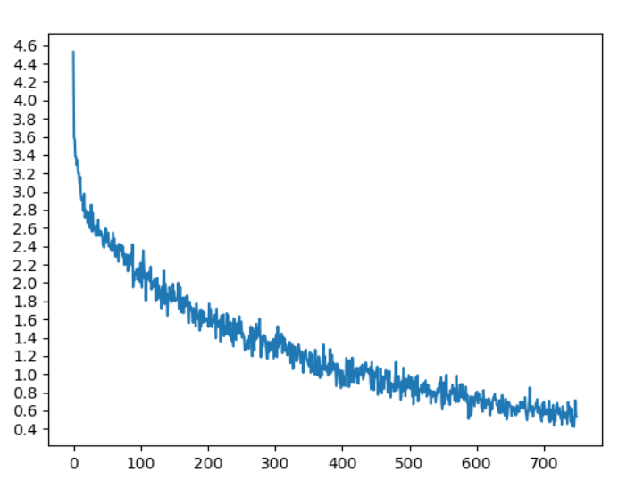
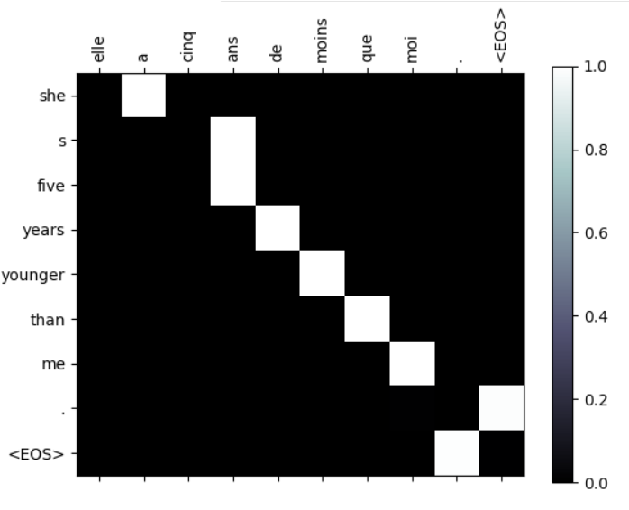
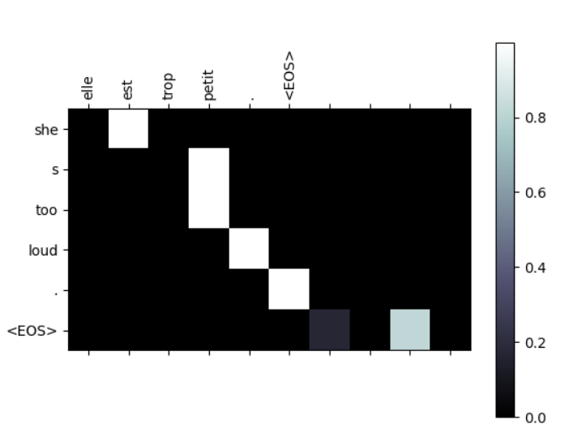

# attention-seq2seq
***
### See for details [https://blog.csdn.net/qq_42714262/article/details/119298940](https://blog.csdn.net/qq_42714262/article/details/119298940)
***
### Requirements
pytorch1.7.1  
python3.8
***
### how to use?
Just execute train.py
***
### Results
1. train loss

2. attention matrix

